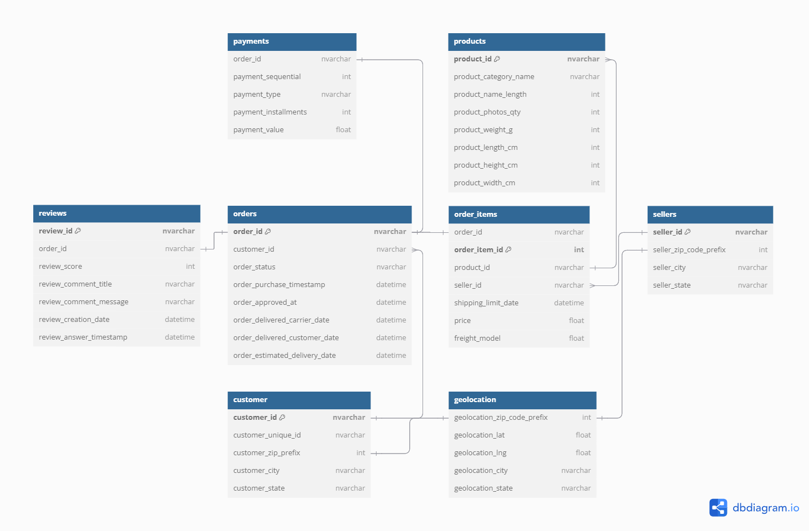

# Optimizing Ecommerce Deliveries
Tools: SQL Server Management Studio\
Dataset: You can access the dataset [here](https://www.kaggle.com/datasets/olistbr/brazilian-ecommerce)

## Understanding the Business Challenge
Delivery delays present a significant challenge for e-commerce businesses, especially when logistics capacity fails to meet the growing demand for shipments. Delays not only disrupt the supply chain but also risk damaging retailer credibility, as customers may leave negative reviews or lose trust in the service. This problem directly impacts the customer experience, potentially reducing customer retention and loyalty.\
To address this issue, we identified several key business questions to guide our analysis using SQL. These questions aim to uncover the root causes of delivery delays and their impact on different dimensions of the e-commerce business, including:
1. What is the percentage of delayed deliveries compared to all deliveries?
2. What is the average delay time compared to the estimated delivery date? 
3. What is the relationship between product dimensions and delivery delays?
4. How does the probability of delay vary across months? Which specific month has the highest delay percentage?
5. Which product categories have the highest delay probability?
6. How does delay probability vary by customer location?
7. How does delay probability vary by seller location?

By answering these questions, we aim to gain actionable insights to optimize delivery performance and address critical delay factors affecting the business.

## Data Overview
The dataset  that we used in this analysis represents  a brazilian e-commerce platform’s (Olist) relational structure, consisting of several interconnected tables that provide detail information about orders, product, payment, customer, seller, etc. This dataset spans a time range from October 2016 to October 2018, capturing transactional data within this period. The relational structure of the dataset is illustrated in the diagram below:



## Q1: What is the percentage of delayed deliveries compared to all deliveries? 
We can calculate the delivery delay percentage by the following formula:\

Delay Percentage = (Number of Delays / Total Orders) × 100%

```sql
SELECT 
    YEAR(order_delivered_customer_date) AS year,
    COUNT(order_id) AS total_orders,
    COUNT(CASE WHEN order_delivered_customer_date > order_estimated_delivery_date 
    THEN 1 END) AS delayed_orders,
    -- menghitung delay_percentage
    COUNT(CASE WHEN order_delivered_customer_date > order_estimated_delivery_date 
    THEN 1 END) * 100.0 / COUNT(*) AS delayed_percentage,
    COUNT(CASE WHEN order_delivered_customer_date <= order_estimated_delivery_date 
    THEN 1 END) * 100.0 / COUNT(*) AS on_time_percentage
FROM 
    olist_orders_dataset
WHERE 
    order_status = 'delivered'
    AND order_delivered_customer_date IS NOT NULL
    AND order_estimated_delivery_date IS NOT NULL
GROUP BY 
    YEAR(order_delivered_customer_date)
ORDER BY 
    year;
```
Output:
|year |total_orders |delayed_percentage	|on_time_percentage |average_delay_days|
|---|---|---|---|---|
|2016	|267 |0.01498127341	|0.9850187266	|13 |
|2017	|40930 |0.05245541168	|0.9475445883	|8 |
|2018	|55273 |0.1026721908	|0.8973278092	|9 |

## Q2: What is the average delay time compared to the estimated delivery date?  

```sql
SELECT 
	YEAR(order_delivered_customer_date) AS year,
	-- menghitung rata-rata keterlambatan (berapa hari)
	AVG(DATEDIFF(DAY, order_estimated_delivery_date, order_delivered_customer_date)) 
	AS average_delay_days
FROM 
	olist_orders_dataset
WHERE
	order_status = 'delivered'
	AND order_delivered_customer_date > order_estimated_delivery_date
	AND order_delivered_customer_date IS NOT NULL
	AND order_estimated_delivery_date IS NOT NULL
GROUP BY
	YEAR(order_delivered_customer_date)
```
Otput:
|year	|average_delay_days |
|---|---|
|2016	|13 |
|2017	|8 |
|2018	|9 |
### Insight
Based on the data, there has been a significant increase in the total number of orders year-over-year, along with a noticeable rise in delivery delays. In 2016, there were **267 orders** with a delivery delay rate of just **1.5%** and an average delay of **13 days**. This number grew to **40,930 orders in 2017**, with a delay rate of** 5.2%** and an average delay of **8 days**. **In 2018, the orders reached 55,273**, with a delay rate of** 10.3%** and an average delay of **9 days**. The increase in delayed orders from 4 in 2016 to 5,675 in 2018 suggests that **the rise in demand has not been fully supported by an increase in logistics capacity**. Given the higher delay percentage and the larger order volume in 2018, it's important to evaluate the factors contributing to these delays and find ways to address them.

## Q3: What is the relationship between product dimensions and delivery delays?
```sql
-- menentukan perhitungan volume product
WITH ProductVolume AS (
    SELECT 
        product_id,
        product_length_cm * product_height_cm * product_width_cm AS product_volume
    FROM 
        olist_products_dataset
),
-- menentukan nilai kuartil dari persebaran volume product
VolumeQuartiles AS (
    SELECT 
        P.product_id,
        P.product_volume,
        NTILE(4) OVER (ORDER BY P.product_volume) AS quartile
    FROM 
        ProductVolume P
),
-- menentukan kategori product berdasarkan volumenya
ProductCategories AS (
    SELECT 
        product_id,
        product_volume,
        CASE 
            WHEN quartile = 1 THEN 'Small'
            WHEN quartile BETWEEN 2 AND 3 THEN 'Medium'
            WHEN quartile = 4 THEN 'Large'
        END AS dimension_category
    FROM 
        VolumeQuartiles
),
-- menentukan jumlah product yang delay
OrderDelays AS (
    SELECT 
        O.order_id,
        O.order_status,
        O.order_estimated_delivery_date,
        O.order_delivered_carrier_date,
        CASE 
            WHEN O.order_delivered_customer_date > O.order_estimated_delivery_date THEN 1
            ELSE 0
        END AS is_delayed
    FROM 
        olist_orders_dataset O
    WHERE 
        O.order_status = 'delivered'
        AND O.order_delivered_carrier_date IS NOT NULL
        AND O.order_estimated_delivery_date IS NOT NULL
        AND YEAR(O.order_delivered_customer_date) = 2018 -- Filter tahun 2018
)
-- menentukan jumlah product yang terlambat berdasarkan kategori volumenya
	SELECT 
        PC.dimension_category,
        COUNT(OD.is_delayed) AS total_orders,
        SUM(OD.is_delayed) AS delayed_orders,
        ROUND((CAST(SUM(OD.is_delayed) AS FLOAT) / COUNT(OD.is_delayed))*100,2) 
        AS delay_percentage
    FROM 
        OrderDelays OD
    JOIN olist_order_items_dataset OI ON OD.order_id = OI.order_id
    JOIN ProductCategories PC ON OI.product_id = PC.product_id
    GROUP BY 
        PC.dimension_category
```
Output:
|dimension_category	|total_orders	|delayed_orders	|delay_percentage |
|---|---|---|---|
|Large	|14614	|1617	|11.06 |
|Medium	|31393	|3039	|9.68 |
|Small	|17062	|1633	|9.57 |

### Insight
The analysis of delivery delays based on product dimensions reveals a notable trend in 2018. Products categorized as "Large" exhibit the highest delay percentage at 11.06%, followed by "Medium" and "Small" products with delay percentages of 9.68% and 9.57%, respectively. This indicates that larger products are more likely to face delivery delays compared to smaller items. The higher delay rate for larger products could be attributed to the logistical challenges associated with handling and shipping bulkier items, such as storage, transportation, and loading constraints.

## Q4: How does the probability of delay vary across months? Which specific month has the highest delay percentage?
```sql
SELECT 
		-- Mengubah angka bulan menjadi nama bulan
    DATENAME(MONTH, O.order_delivered_customer_date) AS delivery_month,
    COUNT(*) AS total_orders,
    SUM(CASE WHEN O.order_delivered_customer_date > O.order_estimated_delivery_date 
    THEN 1 ELSE 0 END) AS delayed_orders,
    ROUND(CAST(SUM(CASE WHEN O.order_delivered_customer_date > O.order_estimated_delivery_date 
    THEN 1 ELSE 0 END) AS FLOAT) / COUNT(*) * 100, 2) AS delay_percentage
FROM 
    olist_orders_dataset O
WHERE 
    O.order_status = 'delivered'
    AND O.order_delivered_customer_date IS NOT NULL
    AND O.order_estimated_delivery_date IS NOT NULL
		AND O.order_delivered_carrier_date IS NOT NULL
GROUP BY 
		-- Group berdasarkan nama bulan
    DATENAME(MONTH, O.order_delivered_customer_date),
    MONTH(O.order_delivered_customer_date)           
ORDER BY 
    MONTH(O.order_delivered_customer_date);
```
Output:
|delivery_month	|total_orders	|delayed_orders	|delay_percentage|
|---|---|---|---|
|January |6880	|667 |9.69|
|February |7201	|386 |5.36|
|March |9206	|1144 |12.43|
|April |9699	|1565 |16.14|
|May |10862	|696 |6.41|
|June |10052	|691	|6.87 |
|July	|9294	|216	|2.32 |
|August	|12616	|996	|7.89 |
|September	|4021	|231	|5.74 |
|October	|4702	|222	|4.72 |
|November	|4727	|244	|5.16 |
|December	|7209	|767	|10.64 |

### Insight
The probability of delivery delays exhibits notable fluctuations across months between 2016 and 2018, as shown in the table above. **April** stands out with the highest delay percentage at **16.14%**, indicating significant challenges in managing deliveries during this period. **March** and **December** follow with delay percentages of **12.43%** and **10.64%**, respectively, possibly reflecting seasonal demand spikes or logistical inefficiencies.

Conversely, **July** demonstrates the lowest delay percentage of **2.32%**, suggesting relatively smooth operational workflows during this month. Other months, such as **February** (**5.36%**) and **May** (**6.41%**), also recorded lower delay rates, hinting at more manageable delivery conditions.

These patterns suggest that certain months, particularly those with higher delay percentages, may experience increased operational pressures, possibly due to higher order volumes, seasonal peaks, or external factors such as weather conditions. Identifying the root causes behind these trends could help design targeted interventions to reduce delays during these critical periods.

## Q5: Which product categories have the highest delay probability?
```sql
SELECT 
    PN.column2 AS product_category,
    COUNT(*) AS total_orders,
    SUM(CASE WHEN O.order_delivered_customer_date > O.order_estimated_delivery_date 
    THEN 1 ELSE 0 END) AS delayed_orders,
    
    ROUND(CAST(SUM(CASE WHEN O.order_delivered_customer_date > O.order_estimated_delivery_date 
    THEN 1 ELSE 0 END) AS FLOAT) / COUNT(*) * 100, 2) AS delay_percentage
FROM 
    olist_products_dataset P
JOIN 
    olist_order_items_dataset OI ON P.product_id = OI.product_id
JOIN 
    olist_orders_dataset O ON O.order_id = OI.order_id
JOIN 
	product_category_name_translation PN ON P.product_category_name = PN.column1
WHERE 
    O.order_status = 'delivered'
    AND O.order_delivered_customer_date IS NOT NULL
    AND O.order_estimated_delivery_date IS NOT NULL
		AND P.product_category_name IS NOT NULL
		AND YEAR(O.order_delivered_customer_date) = 2018 -- Filter tahun 2018
		
GROUP BY 
    PN.column2
ORDER BY 
    delay_percentage DESC;
```
Output:

|product_category	|total_orders	|delayed_orders	|delay_percentage|
|---|---|---|---|
|home_comfort_2	|10	|3	|30 |
|furniture_mattress_and_upholstery	|21	|5	|23.81 |
|fashion_sport	|5	|1	|20 |
|fashion_underwear_beach	|48	|9	|18.75 |
|tablets_printing_image	|22	|4	|18.18 |
|christmas_supplies	|96	|15	|15.63 |
|home_confort	|163	|24	|14.72 |
|audio	|206	|30	|14.56 | 
|garden_tools	|2030	|243	|11.97 |
|toys	|1587	|187	|11.78 |
|books_technical	|221	|26	|11.76 |
|computers	|87	|10	|11.49 |
|electronics	|1925	|213	|11.06 |
|food	|385	|42	|10.91 |
|...|...|...|...|

### Insight
Based on the data, **the product category with the highest delay rate is `home_comfort_2`**, showing a delay percentage of **30%** from a total of 10 orders. This is followed by **`furniture_mattress_and_upholstery`** with a delay percentage of **23.81%** and **`fashion_sport`** at **20%**. Although these categories have relatively low order volumes, the high delay rates indicate potential issues in the supply chain or logistics processes specific to these product types.

Several popular categories with high order volumes, such as **`garden_tools`** (**11.97%**) and **`toys`** (**11.78%**), also demonstrate significant delay percentages. These categories require close attention as their high order volumes could amplify the impact of delays on the overall customer experience.

## Q6: How does delay probability vary by customer location?
```sql
SELECT 
    ST.State_Name AS customer_location,
    COUNT(*) AS total_orders,
    SUM(CASE WHEN O.order_delivered_customer_date > O.order_estimated_delivery_date 
    THEN 1 ELSE 0 END) AS delayed_orders,
    ROUND(CAST(SUM(CASE WHEN O.order_delivered_customer_date > O.order_estimated_delivery_date 
    THEN 1 ELSE 0 END) AS FLOAT) / COUNT(*) * 100, 2) AS delay_percentage
FROM 
    olist_customers_dataset C
JOIN 
    olist_orders_dataset O ON C.customer_id = O.customer_id
JOIN
	state_name_brazil ST ON ST.State_Code = C.customer_state
WHERE 
    O.order_status = 'delivered'
    AND O.order_delivered_customer_date IS NOT NULL
    AND O.order_estimated_delivery_date IS NOT NULL
	AND YEAR(O.order_delivered_customer_date) = 2018 -- Filter tahun 2018
GROUP BY 
    ST.State_Name
ORDER BY 
    delay_percentage DESC;
```
Output:
|customer_location	|total_orders	|delayed_orders	|delay_percentage |
|---|---|---|---|
|Maranhao	|393	|99	|25.19 |
|Alagoas	|208	|50	|24.04 |
|Ceara	|699	|150	|21.46 |
|Tocantins	|152	|30	|19.74 |
|Piaui	|276	|53	|19.2 |
|Para	|507	|93	|18.34 |
|Rio de Janeiro 	|6868	|1258	|18.32 |
|Sergipe	|166	|30	|18.07 |
|Bahia	|1871	|326	|17.42 |
|Mato Grosso do Sul	|428	|71	|16.59 |
|...|...|...|...|

### Insight

The data reveals notable disparities in delivery delay percentages across different customer locations. Maranhão exhibits the highest delay percentage at 25.19%, followed closely by Alagoas (24.04%) and Ceará (21.46%). These regions may face challenges such as inadequate logistics infrastructure, longer delivery routes, or difficulties in coordinating supply chain operations.

## Q7: How does delay probability vary by seller location?
```sql
SELECT 
    ST.State_Name AS seller_location,
    COUNT(*) AS total_orders,
    SUM(CASE WHEN O.order_delivered_customer_date > O.order_estimated_delivery_date 
    THEN 1 ELSE 0 END) AS delayed_orders,
    ROUND(CAST(SUM(CASE WHEN O.order_delivered_customer_date > O.order_estimated_delivery_date 
    THEN 1 ELSE 0 END) AS FLOAT) / COUNT(*) * 100, 2) AS delay_percentage
FROM 
    olist_sellers_dataset S
JOIN 
    olist_order_items_dataset OI ON S.seller_id = OI.seller_id
JOIN
	state_name_brazil ST ON ST.State_Code = S.seller_state
JOIN
	olist_orders_dataset O ON O.order_id = OI.order_id
WHERE 
    O.order_status = 'delivered'
    AND O.order_delivered_customer_date IS NOT NULL
    AND O.order_estimated_delivery_date IS NOT NULL
    AND YEAR(O.order_delivered_customer_date) = 2018 -- Filter tahun 2018
GROUP BY 
    ST.State_Name
ORDER BY 
    delay_percentage DESC;
```
Output:
|seller_location	|total_orders	|delayed_orders	|delay_percentage |
|---|---|---|---|
|Mato Grosso do Sul 	|16	|4	|25 |
|Maranhao	|402	|95	|23.63 |
|Rio Grande do Norte	|28	|3	|10.71 |
|Sao Paulo 	|45339	|4819	|10.63 |
|Rio de Janeiro 	|2919	|310	|10.62 |
|Distrito Federal 	|487	|49	|10.06 |
|Paraiba	|20	|2	|10 |
|Espirito Santo	|142	|13	|9.15 |
|Ceara	|47	|4	|8.51 |
|Santa Catarina 	|2058	|169	|8.21 |
|...|...|...|...|

### Insight
We can observe that several states with the highest delay percentages among the top 12 customer states also appear in the top 12 seller states with the highest delay percentages.\
Based on the data, it is evident that locations such as Maranhão and Mato Grosso do Sul exhibit high delay rates both as seller and customer locations. This suggests a direct relationship between the seller and customer locations in influencing delivery delays. For example, Maranhão shows a significant delay percentage in both categories (23.63% for sellers and 25.19% for customers), indicating potential local logistical challenges. On the other hand, locations like Ceará, Rio de Janeiro, and Espírito Santo display different patterns. For instance, Rio de Janeiro has a significantly lower delay percentage as a seller location (10.62%) compared to as a customer location (18.32%). This indicates that inter-state deliveries to customers in Rio de Janeiro contribute significantly to delays, while deliveries within the state are relatively smoother.

## Recommendations
   1. Order Growth and Its Impact on Delivery Delays\
The number of total orders has significantly increased each year, which has resulted in a corresponding rise in delivery delays. This trend highlights that despite the growth in order volume, logistics capacity has not scaled adequately to manage the demand. To address this, an evaluation of logistics infrastructure and capacity expansion is needed to match the increasing volume and prevent further delays.
   2. Impact of Product Dimensions on Delivery Delays
Larger products (classified as "Large") have higher delay percentages, suggesting that they face more logistical challenges, including transportation and storage issues. Retailers should consider optimizing the logistics processes for bulkier items, possibly using dedicated carriers or adjusting packaging to reduce handling times and minimize delays.
   3. Monthly Fluctuations in Delivery Delays
Delivery delays are particularly high in specific months, with April showing the most significant delays. Seasonal fluctuations, such as higher demand or logistical inefficiencies during peak months, should be closely monitored. Strategies like workforce optimization and improved demand forecasting during these months could help reduce delays.
   4. Product Categories with High Delay Rates
Certain product categories, particularly "home_comfort_2" and "furniture_mattress_and_upholstery," show the highest delay rates, despite low order volumes. High-order-volume categories, such as "garden_tools" and "toys," also have considerable delays. These categories should be prioritized for supply chain improvements to ensure customer satisfaction, given their high impact on overall delays.
   5. Customer and Seller Location Impact on Delivery Delays
Locations like Maranhão and Mato Grosso do Sul show high delay percentages as both seller and customer locations, indicating localized logistical issues. Targeted interventions, such as improving local distribution networks or partnering with regional logistics providers, may be required to reduce delays in these areas. Conversely, Rio de Janeiro experiences lower delays as a seller location but higher delays as a customer location. This suggests that inter-state deliveries are a key contributor to delays. Focus should be placed on improving long-distance delivery capabilities and exploring regional fulfillment centers to improve service levels.


